# Client service Development midterm 1 + 2 

# Table of Contents
- [Prologue](#prologue)
- [Requirements](#requirements)
  - [Requirements for midterm 1](#requirements-for-midterm-1)
  - [Requirements for midterm 2](#requirements-for-midterm-2)
- [Tools and packages](#tools-and-packages)
  - [Tools and Ide's](#tools-and-ides)
  - [Packages and Libraries](#packages-and-libraries)
- [Process](#process)
  - [Midterm 1](#midterm-1)
  - [Midterm 2](#midterm-2)
- [Additional content](#additional-content)
___

## Prologue  
this repo is created to show what ive accomplished in my Uni subject Client Service Deveopment  
and as a front end for [Goland api](https://github.com/K0d0ku/web-serv_midterm2/blob/main/%23images_and_files_2/the_process2.md) that i made for my [Web Service Development midterm 2](https://github.com/K0d0ku/web-serv_midterm2)  
dont worry i excluded `.gitignore` on purpose to show packages and other sensitive files  
Here are the full links for my `Golang api project`:  
- [Github](https://github.com/K0d0ku/web-serv_midterm2)  
- [Readme.md](https://github.com/K0d0ku/web-serv_midterm2/blob/main/README.md)  
- [The_Process2.md](https://github.com/K0d0ku/web-serv_midterm2/blob/main/%23images_and_files_2/the_process2.md)  
and explanation of this project in [Process](#process) preferably [Midterm 2](#midterm-2) (`they are all mandatory to check`)  

##### I know i could do some more work with ui and make it prettier but for the time being i only focused in delivering a functioning front end, and for now its good enough
___

## Requirements
Since both requirements we not so big of the projects themselves i did it all in 1 big project just separated them by pages and ui


### Requirements for midterm 1:
The requirements for midterm 1 was not hard we just had to remake the figma dseign 1 to 1 with react components:
[Midterm 1 Requirement 1](https://github.com/K0d0ku/client-serv_midterm1-2/blob/main/src/Requirements/midterm1/%D0%9C%D0%BE%D0%B4%D1%83%D0%BB%D1%8C%D0%BD%D0%BE%D0%B5%20%D0%B7%D0%B0%D0%B4%D0%B0%D0%BD%D0%B8%D0%B5%20%E2%84%961.pdf)


### Requirements for midterm 2:
The midterm 2 are the ones that are interesting, we had to connect api back end and create a simple front end app 
[Midterm 2 Requirement 1](https://github.com/K0d0ku/client-serv_midterm1-2/blob/main/src/Requirements/midterm2/%D0%9C%D0%BE%D0%B4%D1%83%D0%BB%D1%8C%D0%BD%D0%BE%D0%B5%20%D0%B7%D0%B0%D0%B4%D0%B0%D0%BD%D0%B8%D0%B5%20%E2%84%963.pdf)


[Midterm 2 Requirement 2](https://github.com/K0d0ku/client-serv_midterm1-2/blob/main/src/Requirements/midterm2/%D0%9C%D0%BE%D0%B4%D1%83%D0%BB%D1%8C%D0%BD%D0%BE%D0%B5%20%D0%B7%D0%B0%D0%B4%D0%B0%D0%BD%D0%B8%D0%B5%20%E2%84%964.pdf)

___


## Tools and packages

### Tools and Ide's
- Api - [my own Golang api](https://github.com/K0d0ku/web-serv_midterm2/blob/main/%23images_and_files_2/the_process2.md)
- Ide - Visual Studio Code (optional)
- Endpoint testing - Swagger ui or Postman (optional)

### Packages and Libraries
1. Dependencies

| Package              | Link                                                                                 | Description                                                 |
| -------------------- | ------------------------------------------------------------------------------------ | ----------------------------------------------------------- |
| **react**            | [https://reactjs.org/](https://reactjs.org/)                                         | Core React library for building user interfaces.            |
| **react-dom**        | [https://reactjs.org/docs/react-dom.html](https://reactjs.org/docs/react-dom.html)   | Renders React components to the DOM.                        |
| **react-router-dom** | [https://reactrouter.com/](https://reactrouter.com/)                                 | Handles client-side routing in React applications.          |
| **jwt-decode**       | [https://www.npmjs.com/package/jwt-decode](https://www.npmjs.com/package/jwt-decode) | Decodes JSON Web Tokens (JWT) for authentication workflows. |

2. Dev Dependencies

| Package                         | Link                                                                                                                             | Description                                                                |
| ------------------------------- | -------------------------------------------------------------------------------------------------------------------------------- | -------------------------------------------------------------------------- |
| **vite**                        | [https://vitejs.dev/](https://vitejs.dev/)                                                                                       | Fast frontend build tool and development server.                           |
| **@vitejs/plugin-react**        | [https://github.com/vitejs/vite/tree/main/packages/plugin-react](https://github.com/vitejs/vite/tree/main/packages/plugin-react) | Adds React support (JSX, fast refresh) to Vite.                            |
| **eslint**                      | [https://eslint.org/](https://eslint.org/)                                                                                       | Linter for JavaScript/TypeScript to enforce code quality.                  |
| **@eslint/js**                  | [https://www.npmjs.com/package/@eslint/js](https://www.npmjs.com/package/@eslint/js)                                             | ESLint core rules for JavaScript projects.                                 |
| **eslint-plugin-react-hooks**   | [https://www.npmjs.com/package/eslint-plugin-react-hooks](https://www.npmjs.com/package/eslint-plugin-react-hooks)               | Linting rules for React hooks usage.                                       |
| **eslint-plugin-react-refresh** | [https://www.npmjs.com/package/eslint-plugin-react-refresh](https://www.npmjs.com/package/eslint-plugin-react-refresh)           | Integrates ESLint with React Fast Refresh.                                 |
| **@types/react**                | [https://www.npmjs.com/package/@types/react](https://www.npmjs.com/package/@types/react)                                         | TypeScript type definitions for React.                                     |
| **@types/react-dom**            | [https://www.npmjs.com/package/@types/react-dom](https://www.npmjs.com/package/@types/react-dom)                                 | TypeScript type definitions for ReactDOM.                                  |
| **globals**                     | [https://www.npmjs.com/package/globals](https://www.npmjs.com/package/globals)                                                   | Provides global variables for different environments (browser, Node, etc.) |

they can also be seen in [package.json](https://github.com/K0d0ku/client-serv_midterm1-2/blob/main/package.json)
```
{
  "name": "midterm1",
  "private": true,
  "version": "0.0.0",
  "type": "module",
  "scripts": {
    "dev": "vite",
    "build": "vite build",
    "lint": "eslint .",
    "preview": "vite preview"
  },
  "dependencies": {
    "jwt-decode": "^4.0.0",
    "react": "^19.1.1",
    "react-dom": "^19.1.1",
    "react-router-dom": "^7.9.4"
  },
  "devDependencies": {
    "@eslint/js": "^9.36.0",
    "@types/react": "^19.1.16",
    "@types/react-dom": "^19.1.9",
    "@vitejs/plugin-react": "^5.0.4",
    "eslint": "^9.36.0",
    "eslint-plugin-react-hooks": "^5.2.0",
    "eslint-plugin-react-refresh": "^0.4.22",
    "globals": "^16.4.0",
    "vite": "^7.1.7"
  }
}
```
___

## Process
This section documents how I implemented both midterms, highlights the main goals and architecture decisions, and explains how the front end (this repo) integrates with the Golang API.

### Midterm 1
- Goal: Recreate the provided Figma screens using React components and a component-driven structure.

- What I implemented
  - Layout and pages: a single Midterm 1 page (`midterm1bahandi`) that dynamically swaps two content views (Burgers / Drinks) without routing.
  - Components: all UI blocks live under `src/midterm1/components` and are simple, focused presentational components:

| Component | File | Responsibility |
|---|---|---|
| Header | `src/midterm1/components/header.jsx` | Top navigation and content toggles (switches between burgers/drinks using `setActiveContent`). |
| Burgers | `src/midterm1/components/burgers.jsx` | Renders the burger list cards and "Add to cart" tiles. |
| Drinks | `src/midterm1/components/drinks.jsx` | Renders the drinks list cards. |
| BurgerFooter | `src/midterm1/components/burgerFooter.jsx` | Footer variant used on the Burgers view. |
| DrinksFooter | `src/midterm1/components/drinksFooter.jsx` | Footer variant used on the Drinks view. |
| Page | `src/midterm1/pages/midterm1bahandi.jsx` | Top-level page that holds `activeContent` state and conditionally renders components. |

- Styling: plain CSS files next to the pages/components (see `src/midterm1/pages/midterm1bahandiburger.css`).
- Verification: Visual comparison to the requirement PDF in `src/Requirements/midterm1` and screenshots in `src/Images/midterm1`.

##### Midterm 1 — Example images

Below are a few screenshots that show the design requirements and rendered components for Midterm 1.

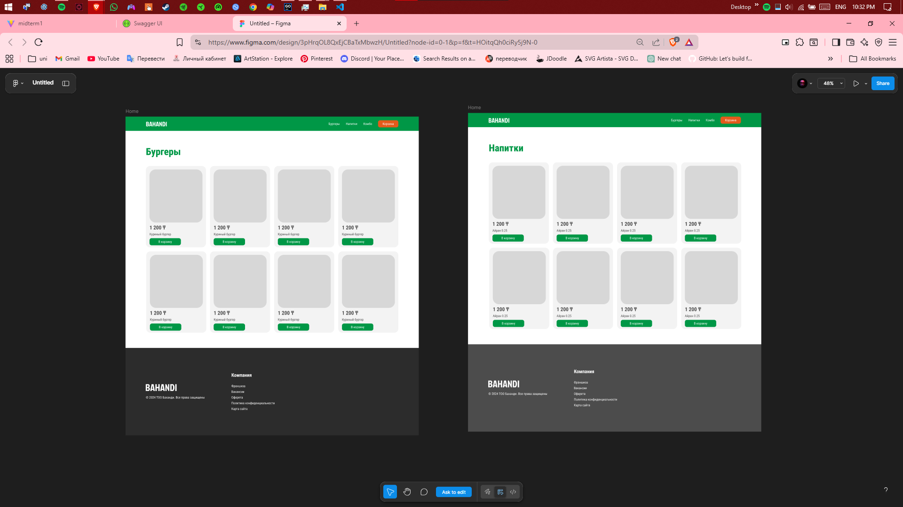


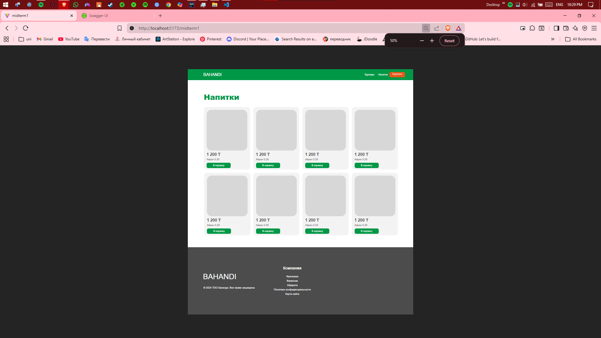

#### Key behaviors and code examples

Below are short excerpts from the repository showing how Midterm 1 switches content, the role of `Header`, and the structure of the content components.

- Header: toggles the active content by calling the `setActiveContent` callback passed from the page.

```jsx
// src/midterm1/components/header.jsx
export default function Header({ setActiveContent }) {
  return (
    <header className="header">
      <div className="logo">BAHANDI</div>
      <div className="navbar">
        <div onClick={() => setActiveContent('burgers')}>Бургеры</div>
        <div onClick={() => setActiveContent('drinks')}>Напитки</div>
        <div className="rectangle"><div>Корзина</div></div>
      </div>
    </header>
  );
}
```

- Top-level page: holds `activeContent` in local state and conditionally renders the corresponding component plus the matching footer. This avoids client-side routing for simple view swaps.

```jsx
// src/midterm1/pages/midterm1bahandi.jsx
import { useState } from 'react';
import Burgers from '../components/burgers';
import Drinks from '../components/drinks';
import Header from '../components/header';
import BurgerFooter from '../components/burgerFooter';
import DrinksFooter from '../components/drinksFooter';

function Midterm1Bahandi() {
  const [activeContent, setActiveContent] = useState('burgers');

  return (
    <div className="home">
      <Header setActiveContent={setActiveContent} />
      {activeContent === 'burgers' && <Burgers />}
      {activeContent === 'drinks' && <Drinks />}
      {activeContent === 'burgers' && <BurgerFooter />}
      {activeContent === 'drinks' && <DrinksFooter />}
    </div>
  );
}
export default Midterm1Bahandi;
```

- Burgers / Drinks (presentational lists): each component renders repeated item cards — they are intentionally simple and styled via CSS. Example (abridged):

```jsx
// src/midterm1/components/burgers.jsx (abridged)
export default function Burgers() {
  return (
    <div className="burgers">
      <div className="text-wrapper-4-burg">Бургеры</div>
      <div className="burger-list">
        <div className="group">
          <div className="text-wrapper-5">Куриный бургер</div>
          <div className="text-wrapper-6">1 200 ₸</div>
          <div className="text-wrapper-7">В корзину</div>
        </div>
        {/* repeated groups... */}
      </div>
    </div>
  );
}
```

#### Why this structure

- Simplicity: the assignment required faithful visual reproduction — using small presentational components and CSS keeps the structure close to the Figma files and easy to reason about.
- No routing for view swaps: the page switches content using an internal state variable to match the original single-screen UX from the design (faster to implement and simple to test).

### Midterm 2

- Goal: Build a minimal, production-aware front end that integrates with the Golang REST API (the API project is here: https://github.com/K0d0ku/web-serv_midterm2). The front end demonstrates authentication (JWT), protected routes, search, and CRUD-style interactions with the API endpoints.

- What the front end implements:
  - Pages / routes (files to inspect):
    - `src/midterm2/pages/midterm2Landing.jsx` — project landing for Midterm 2.
    - `src/midterm2/pages/login/Login.jsx` — login form that requests a JWT from the API.
    - `src/midterm2/pages/register/Registration.jsx` — registration page.
    - `src/midterm2/pages/profile/Profile.jsx` — user profile page.
    - `src/midterm2/pages/updates/user/UpdateUser.jsx` — update user data.
    - `src/midterm2/pages/search/SearchResults.jsx` and `SearchResultExpand.jsx` — search UI and results.
    - Global layout: `src/midterm2/Header.jsx` and `src/midterm2/Footer.jsx`.

  - Authentication flow:
    - Login calls the API `POST /login` and receives a JWT. The client decodes token claims with `jwt-decode` to read role/ID and stores the token (localStorage or sessionStorage) for API calls.
    - Protected routes check for a valid token and redirect to `/login` when missing.
    - API calls include `Authorization: Bearer <token>` when a token is present.

  - Main interactions and UX:
    - Search UI uses the API search endpoint and shows results with pagination or expandable details.
    - Profile and update pages let users view and edit their own account data via the `/users/:id` endpoints.
    - Error and loading states are surfaced to the user (simple messages and spinners where appropriate).

- API endpoints used (summary)
  - Auth / Users:
    - `POST /register` — register a new user.
    - `POST /login` — obtain JWT token.
    - `GET /users` — list users (Admin only).
    - `GET /users/:id`, `PUT /users/:id`, `DELETE /users/:id` — user profile operations (self or Admin).

  - Music:
    - `GET /music` — list all music.
    - `GET /music/:id` — get music by id.
    - `POST /music` — create music (Artist/Admin).
    - `PUT /music/:id`, `DELETE /music/:id` — update/delete (Artist/Admin, ownership enforced).
    - Additional useful endpoints added in the API and consumed by the front end:
      - `GET /music/artist/:artistId` — music by a specific artist.
      - `GET /music/artists` — list all artists.
      - `GET /music/search?q=QUERY` — search music by title, artist name or genre.
      - `GET /music/artist-data/:id` — get artist profile data.

  - Genres:
    - `GET /genres`, `GET /genres/:id` — list and get genre (any authenticated user).
    - `POST /genres`, `PUT /genres/:id`, `DELETE /genres/:id` — Admin only.

- Backend notes integrated from the Go project (key points):
  - The API enforces RBAC (Admin / Artist / Listener) and validates requests with `go-playground/validator`.
  - JWT authorization is used and verified in middleware; the token contains `sub` (user id) and `role` claims.
  - The API enables CORS for the React origin used in development (`http://localhost:5173`).
  - The front end uses only the public endpoints described above; full API documentation and examples are available in the Go repo's process doc: [the_process2.md](https://github.com/K0d0ku/web-serv_midterm2/blob/main/%23images_and_files_2/the_process2.md)

- How to run the front end with the Golang API:
  1. Install dependencies: `npm install`.
  2. Create a `.env` at the project root (Vite prefix) with the API base URL, for example:
     - `VITE_API_BASE_URL=http://localhost:8080`
  3. Start the dev server: `npm run dev` (Vite default port is `5173`).
  4. Make sure the Golang API is running and reachable (default `http://localhost:8080`).

- Where to look in the repo:
  - `src/midterm1` — Midterm 1 components and page(s).
  - `src/midterm2` — Midterm 2 pages, header/footer, login/register/profile/search components.
  - `src/Requirements/midterm2` — requirement PDFs and reference images.
  - `src/Images/midterm2` — screenshots used in documentation demonstrating RBAC and API-driven UI states.

#### Profile (Midterm 2)

This project implements a simple profile flow: login, view profile, update credentials, and delete account. The UI and flows are implemented across `Login.jsx`, `UpdateUser.jsx`, and `Profile.jsx`.

Profile endpoints (used by the front end):

| Action | Endpoint | Notes |
|---|---|---|
| Get current user's profile | `GET /users/:id` | Client uses stored `userId` from login and passes `Authorization: Bearer <token>` header. |
| Update profile | `PUT /users/:id` | Sends JSON body with `name`, `email`, `password` as needed. Requires auth. |
| Delete account | `DELETE /users/:id` | Deletes the user account (self or Admin). |

Login (short): `src/midterm2/pages/login/Login.jsx` stores `jwtToken`, `userId` and `role` in `localStorage` on success:

```jsx
// Login handler (abridged)
const response = await fetch('http://localhost:8080/login', {
  method: 'POST',
  headers: { 'Content-Type': 'application/json' },
  body: JSON.stringify({ email, password })
});
const data = await response.json();
localStorage.setItem('jwtToken', data.token);
localStorage.setItem('userId', data.userId);
localStorage.setItem('role', data.role);
navigate('/midterm2');
```

View profile and fetch user data: `src/midterm2/pages/updates/user/UpdateUser.jsx` reads `userId` and `jwtToken` from `localStorage` then calls `GET /users/:id`:

```jsx
// fetch profile on mount (abridged)
const token = localStorage.getItem('jwtToken');
const userId = localStorage.getItem('userId');
fetch(`http://localhost:8080/users/${userId}`, {
  headers: { Authorization: `Bearer ${token}` }
})
  .then(res => res.json())
  .then(data => { setUserData(data); setFormData({ email: data.Email, name: data.Name }); });
```

Update credentials: the update form posts to `PUT /users/:id` with the edited fields and the `Authorization` header; on success the UI navigates back to profile.

```jsx
// submit update (abridged)
const response = await fetch(`http://localhost:8080/users/${user.id}`, {
  method: 'PUT',
  headers: { 'Content-Type': 'application/json', Authorization: `Bearer ${token}` },
  body: JSON.stringify(formData)
});
if (!response.ok) throw new Error('Failed to update user');
navigate('/midterm2/profile');
```

Delete account: the client calls `DELETE /users/:id` with `Authorization` header and the API removes the user. The project includes screenshots showing the API log and DB state before/after deletion (see images below).

Example UI and DB images (stored in `src/Images/midterm2/RBAC_Pages_Roles/Profile`):

| What | Image |
|---|---|
| Login and go to Profile | 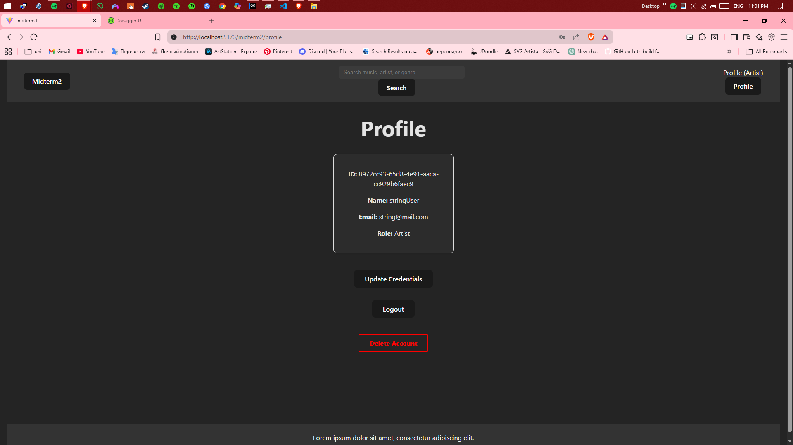 |
| Profile page (before update) | 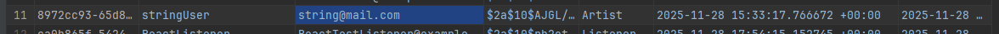 |
| Update credentials (UI) | 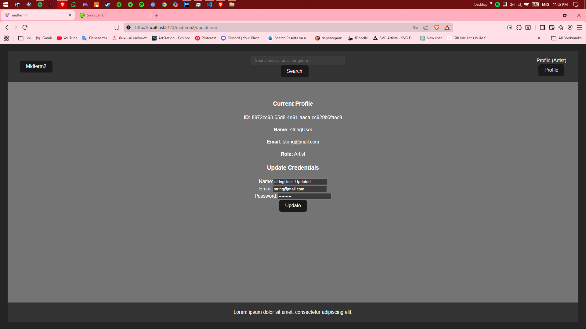 |
| Update reflected in DB | 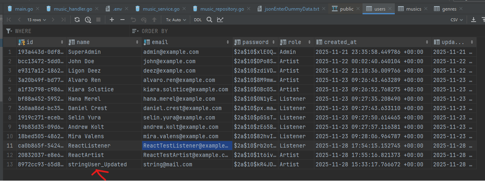 |
| Update UI after save |  |
| Delete account confirmation | 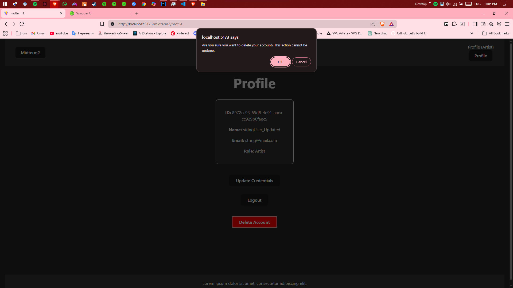 |
| Delete account log entry |  |
| DB state after delete | 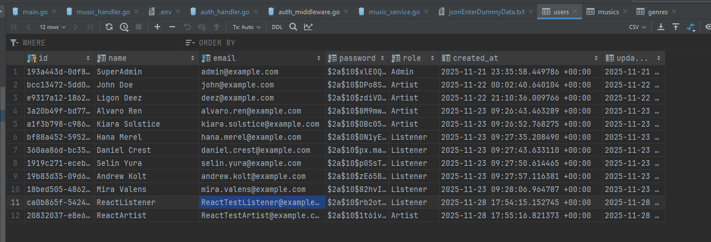 |

Notes:
- The front end verifies tokens client-side before calling protected endpoints. If the token is missing or invalid the page redirects to login.
- For demonstration the repository includes API logs and DB screenshots — these are educational and show the sequence of actions and their effects on the backend.

##### Midterm 2 — Example screenshots

These images illustrate the main Midterm 2 flows (login / role-specific UIs, search and result expansion, profile updates).

| Flow | Screenshot |
|---|---|
| Login / Role UIs |  |
| Admin dashboard | 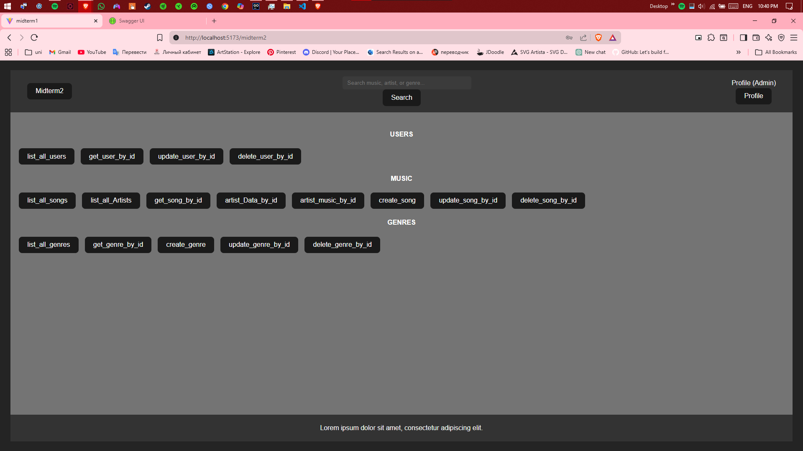 |
| Artist / Listener UIs | 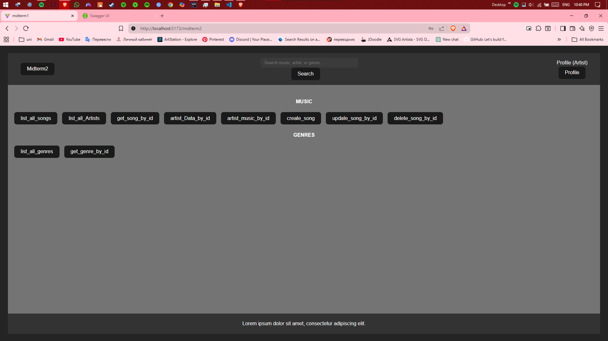 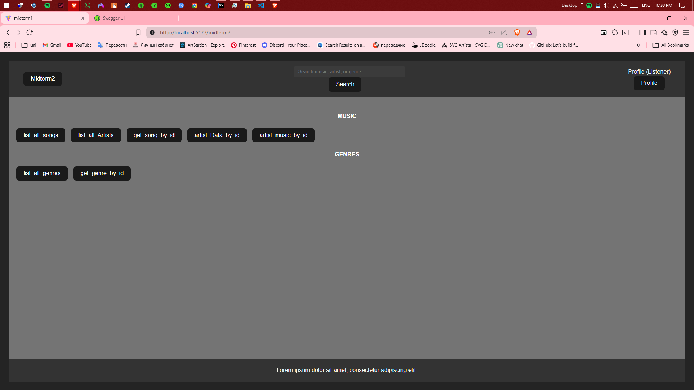 |
| Search & results |  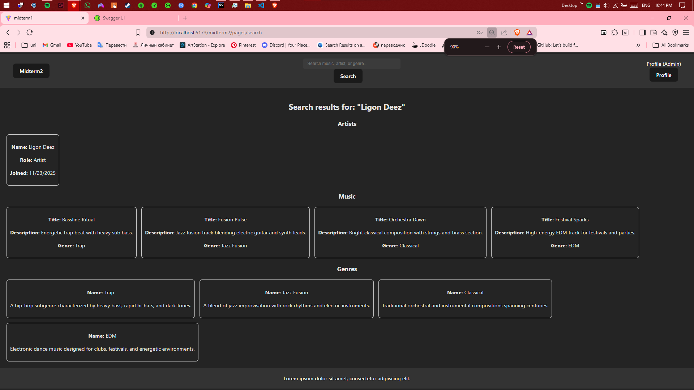 |
| Result expand (artist/music) | 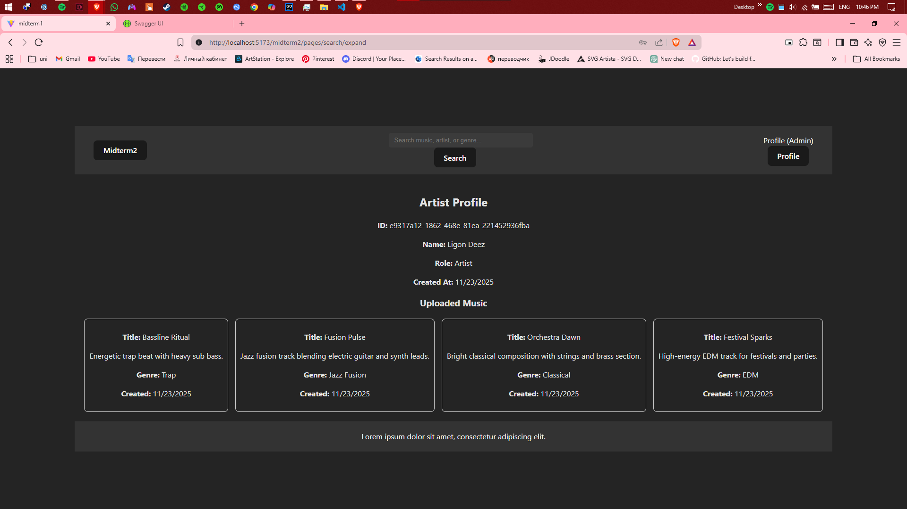 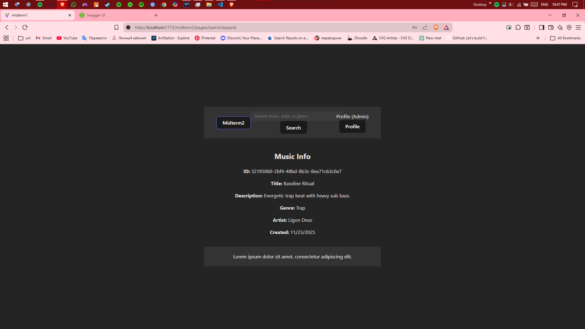 |

#### RBAC Matrix (summary)

The backend enforces role-based access control. This table summarizes which roles can access main endpoints (Admin / Artist / Listener):

| Endpoint | Admin | Artist | Listener |
|---|---:|---:|---:|
| POST /register | Allow | Allow | Allow |
| POST /login | Allow | Allow | Allow |
| GET /users | Allow | Deny | Deny |
| GET /users/:id | Allow | Own only | Own only |
| PUT /users/:id | Allow | Own only | Own only |
| DELETE /users/:id | Allow | Own only | Own only |
| GET /music | Allow | Allow | Allow |
| GET /music/:id | Allow | Allow | Allow |
| POST /music | Allow | Allow | Deny |
| PUT /music/:id | Allow | Own only | Deny |
| DELETE /music/:id | Allow | Own only | Deny |
| GET /music/artist/:artistId | Allow | Allow | Allow |
| GET /music/artists | Allow | Allow | Allow |
| GET /music/search?q= | Allow | Allow | Allow |
| GET /music/artist-data/:id | Allow | Allow | Allow |
| GET /genres | Allow | Allow | Allow |
| GET /genres/:id | Allow | Allow | Allow |
| POST /genres | Allow | Deny | Deny |
| PUT /genres/:id | Allow | Deny | Deny |
| DELETE /genres/:id | Allow | Deny | Deny |

The table is derived from the Go API's RBAC rules (see the API process doc linked earlier). "Own only" means the role can act only on resources they own (checked by user ID / ownership in the backend).

#### Code examples (how it's implemented in the front end)

Below are short, copy-pasteable excerpts from the project showing how login, token decoding, RBAC-driven UI, search navigation, and fetch calls are implemented.

- Login: the client posts credentials and stores the JWT, userId and role in `localStorage` (see `src/midterm2/pages/login/Login.jsx`)

```jsx
// src/midterm2/pages/login/Login.jsx
const response = await fetch('http://localhost:8080/login', {
  method: 'POST',
  headers: { 'Content-Type': 'application/json' },
  body: JSON.stringify({ email, password })
});
const data = await response.json();
localStorage.setItem('jwtToken', data.token);
localStorage.setItem('userId', data.userId);
localStorage.setItem('role', data.role);
navigate('/midterm2');
```

- Header search navigation: the header sends the query to the Search page using `navigate()` and `location.state` (see `src/midterm2/Header.jsx`)

```jsx
// src/midterm2/Header.jsx
const handleSearch = () => {
  if (searchQuery.trim() === "") return;
  navigate('/midterm2/pages/search', { state: { query: searchQuery } });
};
```

- Landing: decode the token and render UI based on role (see `src/midterm2/pages/midterm2Landing.jsx`)

```jsx
// src/midterm2/pages/midterm2Landing.jsx
useEffect(() => {
  const token = localStorage.getItem('jwtToken');
  if (token) {
    try {
      const decoded = jwtDecode(token);
      setUser({ id: decoded.sub, role: decoded.role });
    } catch {
      localStorage.removeItem('jwtToken');
    }
  }
}, []);

const roleMap = {
  Admin: ['users','music','genres'],
  Artist: ['music','genres'],
  Listener: ['music','genres']
};

// Later: only allowed categories are rendered
{roleMap[user.role].map(category => <CategoryPanel ... />)}
```

- CategoryPanel: builds requests, injects Authorization header, handles responses (excerpt)

```jsx
// inside CategoryPanel (midterm2Landing)
const token = localStorage.getItem('jwtToken');
let url = action.url;
if (action.requiresInput && inputObj) {
  if (url.includes(':id')) url = url.replace(':id', inputObj.id);
  if (url.includes(':artistId')) url = url.replace(':artistId', inputObj.id);
}
const res = await fetch(url, {
  method: action.method,
  headers: { 'Authorization': `Bearer ${token}`, 'Content-Type': 'application/json' },
  body: body ? JSON.stringify(body) : null
});
const data = await res.json().catch(() => null);

// results stored in component state and rendered with small cards (UserCard, MusicCard, etc.)
```

- SearchResults: receives `query` through `location.state`, validates token and calls the search endpoint

```jsx
// src/midterm2/pages/search/SearchResults.jsx
const { query } = location.state || {};
const token = localStorage.getItem('jwtToken');
fetch(`http://localhost:8080/music/search?q=${encodeURIComponent(query)}`, {
  headers: { Authorization: `Bearer ${token}` }
})
  .then(res => res.json())
  .then(data => { /* split into artists/music/genres for UI */ });
```

- SearchResultExpand: fetches artist profile + artist music (Promise.all), or music/genre details depending on `type`.

```jsx
// src/midterm2/pages/search/SearchResultExpand.jsx
if (type === 'artist') {
  Promise.all([
    fetch(`http://localhost:8080/music/artist-data/${id}`, { headers: { Authorization: `Bearer ${token}` } }),
    fetch(`http://localhost:8080/music/artist/${id}`, { headers: { Authorization: `Bearer ${token}` } })
  ])
  .then(async ([artistRes, musicRes]) => {
    const artistData = await artistRes.json();
    const musicData = await musicRes.json();
    setArtist(artistData);
    setArtistMusic(musicData);
  });
}
```

These code excerpts are intentionally small and focused — they show how the front end reads/stores tokens, decides which UI to render based on role, navigates with search state, and uses `fetch()` with `Authorization` headers to call the API.


#### Authentication, RBAC and UI data flow (how it actually works in this project)

- Login & token handling:
  - `src/midterm2/pages/login/Login.jsx` posts credentials to `POST /login`. On success the handler stores `jwtToken`, `userId` and `role` in `localStorage` (see `localStorage.setItem('jwtToken', data.token)`).
  - Components that need authentication read the token from `localStorage` (many pages use `localStorage.getItem('jwtToken')`) and parse the token payload to extract `sub` (user id) and `role` when needed. The code uses a lightweight decode (manual `atob` and JSON.parse on the token payload) or `jwt-decode` in `midterm2Landing.jsx`.

- Role-Based UI (RBAC):
  - `midterm2Landing.jsx` contains a `roleMap` and `endpoints` definitions that map API actions to allowed roles. When the landing page reads the decoded token it sets `user` with `{ id, role }` and renders only those `CategoryPanel`s permitted by `roleMap[user.role]`.
  - Each `CategoryPanel` filters the endpoint actions by `action.roles.includes(userRole)` before rendering the action tiles, so Admin/Artist/Listener see different available actions in the same UI.

- Protecting pages and per-user actions:
  - Pages that require a logged-in user check for a token and redirect to login if missing (see `SearchResults.jsx`, `SearchResultExpand.jsx`, `UpdateUser.jsx`). `SearchResults` decodes the token payload and calls `navigate('/midterm2/login')` when the token is absent or invalid.
  - For user-specific operations (reading/updating profile), the front end reads `userId` from `localStorage` (set at login) and uses it when calling `GET /users/:id` or `PUT /users/:id`, ensuring the UI only updates the current user's profile.

#### Search flow (Header → SearchResults → SearchResultExpand)

- Initiating search from the header:
  - `src/midterm2/Header.jsx` holds a `searchQuery` state and on submit it navigates to the search page using `navigate('/midterm2/pages/search', { state: { query: searchQuery } })`.

- Fetching and rendering results:
  - `src/midterm2/pages/search/SearchResults.jsx` receives the `query` via `location.state`, verifies the token, then calls `GET /music/search?q=${query}` with the `Authorization: Bearer <token>` header.
  - The search response (an array of music objects with joined Artist and Genre data) is split client-side into `artists`, `music`, and `genres` lists. These are shown as clickable tiles.

- Expanding an item:
  - Clicking a tile navigates to `/midterm2/pages/search/expand` with `{ state: { type: 'artist'|'music'|'genre', id } }`.
  - `SearchResultExpand.jsx` reads the `type` and `id`, verifies the token, then fetches the appropriate endpoint(s):
    - artist: `GET /music/artist-data/:id` and `GET /music/artist/:id` (artist profile and their music)
    - music: `GET /music/:id`
    - genre: `GET /genres/:id`
  - The expand page renders detailed UI depending on `type` (artist profile + their music, music details, or genre info).

#### Dynamic UI & component responsibilities

- `Header.jsx` — search input, navigation to Midterm2 main page, Profile link. Displays `Profile (role)` when `user` prop is present; otherwise shows "Not logged in".
- `midterm2Landing.jsx` — the RBAC dashboard: decodes JWT (using `jwt-decode`), sets `user` state, and renders `CategoryPanel` components filtered by user role. `CategoryPanel` contains action tiles that construct URLs (replace `:id` / `:artistId`) and perform fetch requests with the stored token.
- `CategoryPanel` — responsible for building request payloads based on user inputs, injecting `Authorization` header, calling the API, and rendering returned results with small card components (`UserCard`, `ArtistCard`, `MusicCard`, `GenreCard`).
- `SearchResults.jsx` / `SearchResultExpand.jsx` — handle search lifecycle, token validation, API calls, and conditional UI rendering for details and lists.

These behaviors are implemented with plain `fetch()` calls and simple client-side checks (token presence and decoding). The README now documents how the token and role are used to control UI visibility and to make authenticated requests across pages.
___

## Additional content

Unused imagery (we haven't embedded these yet but they fit project contexts):

Midterm 1 images:

- image context: additional design mock or origin page useful for landing/intro visuals
  

Midterm 2 images (recommended uses: API action examples, DB snapshots, and test results):

- image context: Admin — user management log (useful for documenting Admin flows)
  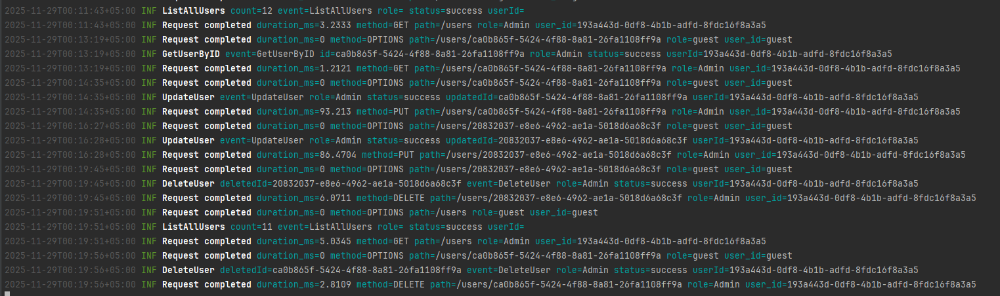

- image context: Admin — users table snapshot (DB) (show before/after operations)
  

- image context: Admin — create genre (API test view / swagger example)
  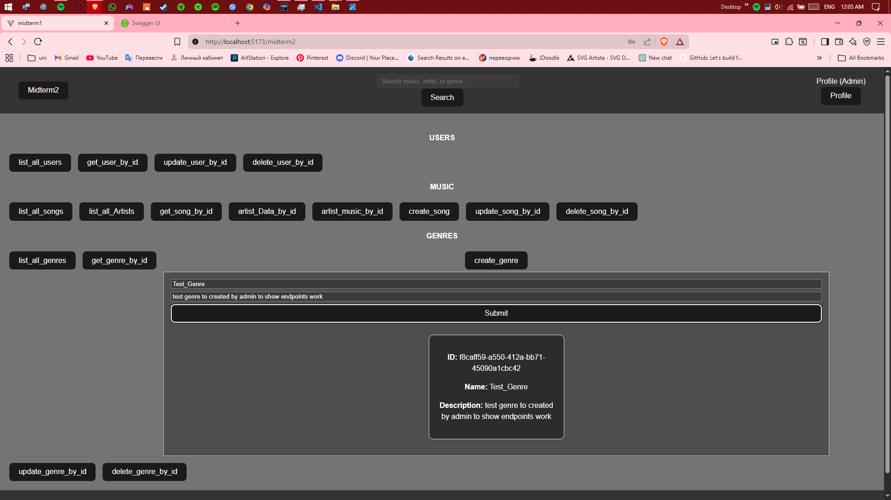

- image context: Artist — create song (API result and DB snapshot)
  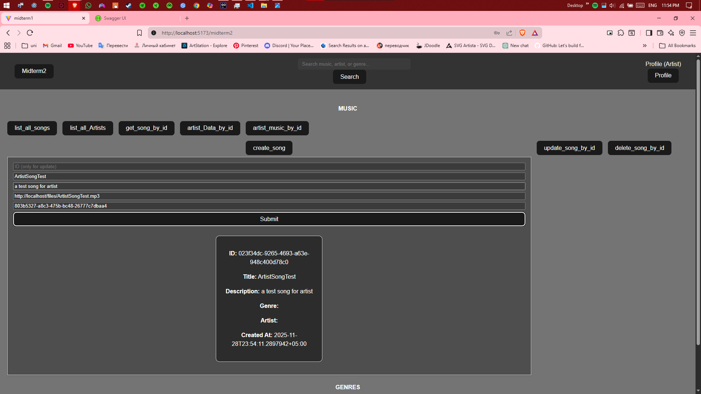

- image context: Artist — update / delete song logs and DB state (ownership restrictions examples)
  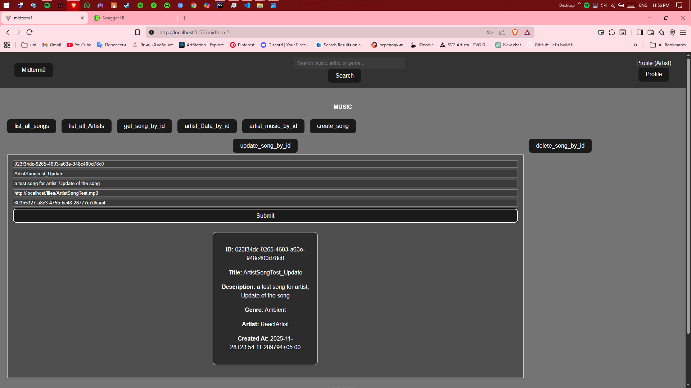
  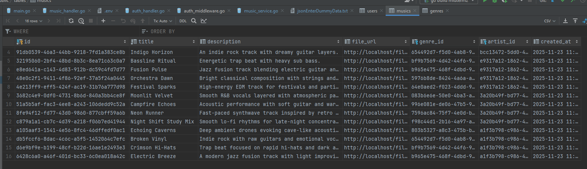

- image context: Listener — list all songs / list artists (good for search/results documentation)
  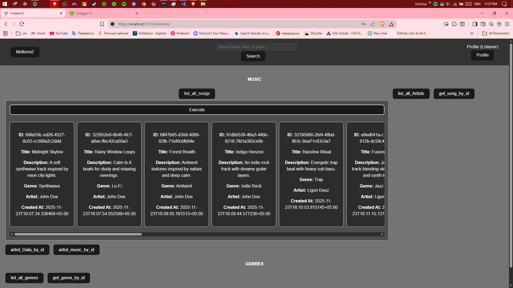
  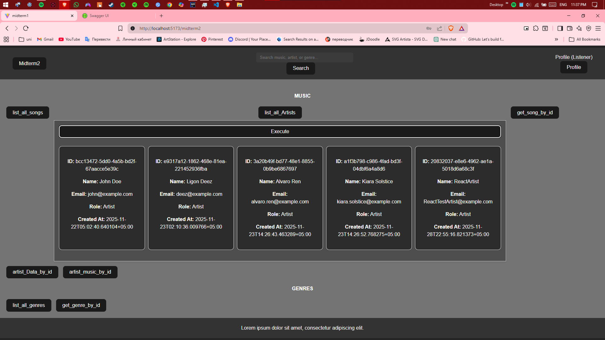

- image context: Register flow — DB before/after, useful for showing registration side-effects
  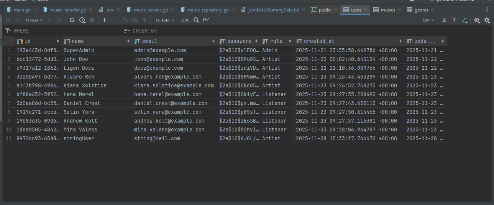
  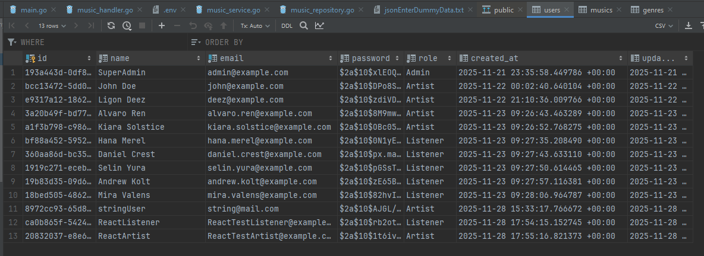

- image context: Search logs / Postman collection screenshot (useful for API testing docs)
  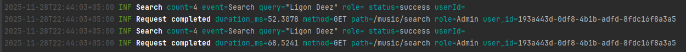

Remote (Go API project) images:

- image context: API process screenshots and test screenshots (Swagger / Postman)
  

- image context: API validation example (remote)
  

Most of the images and files that are not shown here are located in:  
- [Requirements](https://github.com/K0d0ku/client-serv_midterm1-2/tree/main/src/Requirements)
  - [Midterm 1](https://github.com/K0d0ku/client-serv_midterm1-2/tree/main/src/Requirements/midterm1)
  - [Midterm 2](https://github.com/K0d0ku/client-serv_midterm1-2/tree/main/src/Requirements/midterm2)
- [Images](https://github.com/K0d0ku/client-serv_midterm1-2/tree/main/src/Images)
  - [Midterm 1](https://github.com/K0d0ku/client-serv_midterm1-2/tree/main/src/Images/midterm1)
  - [Midterm 2](https://github.com/K0d0ku/client-serv_midterm1-2/tree/main/src/Images/midterm2/RBAC_Pages_Roles)
    - [Actions](https://github.com/K0d0ku/client-serv_midterm1-2/tree/main/src/Images/midterm2/RBAC_Pages_Roles/Actions)
      - [Admin](https://github.com/K0d0ku/client-serv_midterm1-2/tree/main/src/Images/midterm2/RBAC_Pages_Roles/Actions/Admin)
        - [Genre](https://github.com/K0d0ku/client-serv_midterm1-2/tree/main/src/Images/midterm2/RBAC_Pages_Roles/Actions/Admin/Genre)
        - [User](https://github.com/K0d0ku/client-serv_midterm1-2/tree/main/src/Images/midterm2/RBAC_Pages_Roles/Actions/Admin/User)
      - [Artist](https://github.com/K0d0ku/client-serv_midterm1-2/tree/main/src/Images/midterm2/RBAC_Pages_Roles/Actions/Artist/Music)
        - [Music](https://github.com/K0d0ku/client-serv_midterm1-2/tree/main/src/Images/midterm2/RBAC_Pages_Roles/Actions/Artist/Music)
      - [Listener](https://github.com/K0d0ku/client-serv_midterm1-2/tree/main/src/Images/midterm2/RBAC_Pages_Roles/Actions/Listener)
        - [Genres](https://github.com/K0d0ku/client-serv_midterm1-2/tree/main/src/Images/midterm2/RBAC_Pages_Roles/Actions/Listener/Genres)
        - [Music](https://github.com/K0d0ku/client-serv_midterm1-2/tree/main/src/Images/midterm2/RBAC_Pages_Roles/Actions/Listener/Music)
    - [Profile](https://github.com/K0d0ku/client-serv_midterm1-2/tree/main/src/Images/midterm2/RBAC_Pages_Roles/Profile)
    - [Register](https://github.com/K0d0ku/client-serv_midterm1-2/tree/main/src/Images/midterm2/RBAC_Pages_Roles/Register)
    - [Search](https://github.com/K0d0ku/client-serv_midterm1-2/tree/main/src/Images/midterm2/RBAC_Pages_Roles/Search)
    - [Login](https://github.com/K0d0ku/client-serv_midterm1-2/tree/main/src/Images/midterm2/RBAC_Pages_Roles/login)